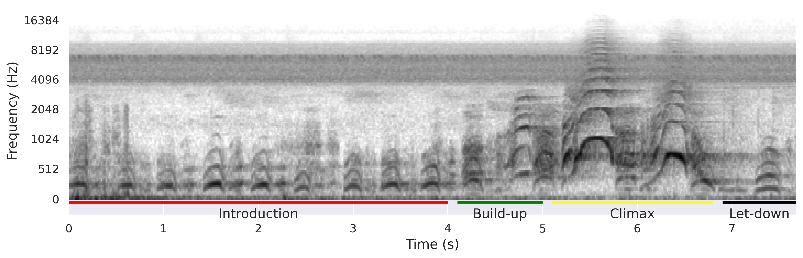
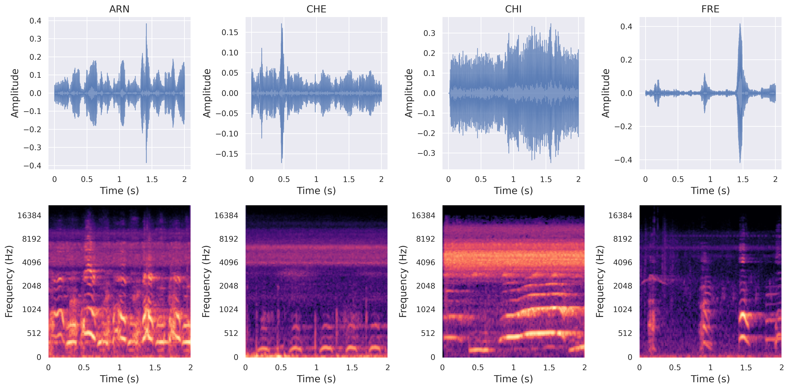
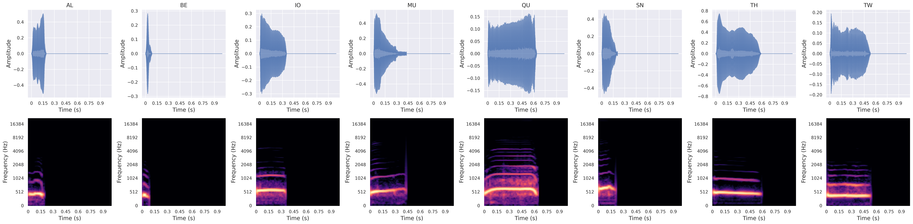

Below is a **cleaned, reorganized, and professional** README where:
# **Vocal Individuality in Male Chimpanzees (*Pan troglodytes troglodytes*) in the Wild: An Explainable Deep Learning Analysis**

[]()
[]()
[]()
[]()
[]()

This repository provides the full pipeline for detecting vocal individuality in wild chimpanzee pant-hoots using deep learning and explainable AI methods.
It includes preprocessing tools, training code, hyperparameter optimization, classical ML baselines, and a suite of saliency-based interpretability methods.

External macaque dataset (used for cross-species validation):
[https://github.com/earthspecies/library/tree/main/macaques](https://github.com/earthspecies/library/tree/main/macaques)

---

# **📑 Table of Contents**

* [Overview](#overview)
* [Installation](#installation)
* [Configuration](#configuration)
* [CLI Arguments](#cli-arguments)
* [Dataset Preparation](#dataset-preparation)
* [Training & Hyperparameter Optimization](#training--hyperparameter-optimization)

  * [Deep Learning Models](#1-deep-learning-models)
  * [Classical ML Models](#2-classical-ml-models)
* [Explainability & Saliency Maps](#explainability--saliency-maps)
* [Notebooks](#notebooks)
* [Sample Outputs](#sample-outputs)

  * [Chimpanzees](#chimpanzees)
  * [Macaques](#macaques)
* [Acknowledgements](#acknowledgements)

---

# **Overview**

This project examines whether deep learning models can identify individual wild chimpanzees based solely on pant-hoot vocalizations.
The pipeline includes:

* Audio preprocessing
* Spectrogram generation
* CNN/Transformer model training
* Hyperparameter search with Optuna
* Traditional ML baselines
* Saliency-based explainability
* Cross-species generalization experiments

---

# **Installation**

## Clone Repository

```bash
git clone git@github.com:yusufbrima/ChimpXAI.git
cd ChimpXAI
```

## Create & Activate Environment

```bash
conda env create -n chimpxai python=3.12
conda activate chimpxai
pip install -r requirements.txt
```

---

# **Configuration**

All customizable settings (paths, audio parameters, model configs, spectrogram settings, etc.) are stored in:

```
config.py
```

You should edit this file before running experiments.

---

# **CLI Arguments**

These flags are used throughout training, hyperparameter search, and explainability scripts:

| Flag             | Description                                        |
| ---------------- | -------------------------------------------------- |
| `--model_name`   | Model class (`CustomCNNModel`, `ViTModel`)         |
| `--modelstr`     | Architecture (`dense121`, `resnet18`)              |
| `--experiment`   | Integer experiment ID                              |
| `--target_class` | Label group (`chimpanzee_ir`, `macaque`, etc.)     |
| `--n_trials`     | Number of Optuna trials                            |
| `--ft`           | Use fine-tuned model (`True`/`False`)              |
| `--duration`     | Duration (seconds) of audio used for visualization |
| `--model_type`   | Category (`classifier`)                            |

---

# **Dataset Preparation**

## Split the Dataset

```bash
python splitter.py
```

This organizes audio into training, validation, and test sets.

---

# **Training & Hyperparameter Optimization**

To run multiple experiments in parallel:

```bash
bash run_all_parallel.sh
```

---

## **1) Deep Learning Models**

### **(a) Hyperparameter Search (Optuna)**

```bash
python optuna_search.py \
    --model_name "$MODEL_NAME" \
    --modelstr "$MODEL_STR" \
    --target_class "$TARGET" \
    --n_trials "$N_TRIALS_DEEP" \
    --experiment "$EXPERIMENT_ID"
```

### **(b) Train the Model with Best Hyperparameters**

```bash
python train_with_best_hyperparams.py \
    --model_name "$MODEL_NAME" \
    --modelstr "$MODEL_STR" \
    --experiment "$EXPERIMENT_ID" \
    --target_class "$TARGET"
```

---

## **2) Classical ML Models**

### **(a) Hyperparameter Search**

```bash
python classical_model_optuna_all.py \
    --n_trials "$N_TRIALS_CLASSICAL" \
    --experiment "$EXPERIMENT_ID"
```

### **(b) Train Final Classical Models**

```bash
python train_final_classical_models.py \
    --experiment "$EXPERIMENT_ID"
```

---

# **Explainability & Saliency Maps**

## Compute saliency maps for a specific model

```bash
python saliency.py \
    --experiment 103 \
    --model_name CustomCNNModel \
    --modelstr dense121 \
    --ft false
```

## Run all XAI methods for a model

```bash
python sal.py \
    --experiment 100 \
    --model_name CustomCNNModel \
    --modelstr dense121 \
    --ft false
```

## Run saliency for all models for a dataset

```bash
./run_all_saliency_models.sh
```

---

# **Notebooks**

Exploration, visualization, and analysis notebook:

```
Playground.ipynb
```

---

# **Sample Outputs**

## **Chimpanzees**

### Annotated pant-hoot spectrogram



### Waveform and spectrogram



### Sample saliency maps (ResNet18)


---

## **Macaques**

### Waveform and spectrogram



### Sample saliency maps


---

# **Acknowledgements**

We thank the Agence Nationale des Parcs Nationaux and the Centre National de la Recherche Scientifique et Technique of Gabon for permitting research in Loango National Park.

Special thanks to:
C. Boesch, T. Deschner, A. Mascaro, F. Makaya, U. Bora Moussouami, and the Ozouga Research Team.

**Funding:**

* Deutsche Forschungsgemeinschaft (DFG) – Computational Cognition (GRK2340)
* European Research Council (ERC) – Consolidator Grant (772000, TurnTaking)